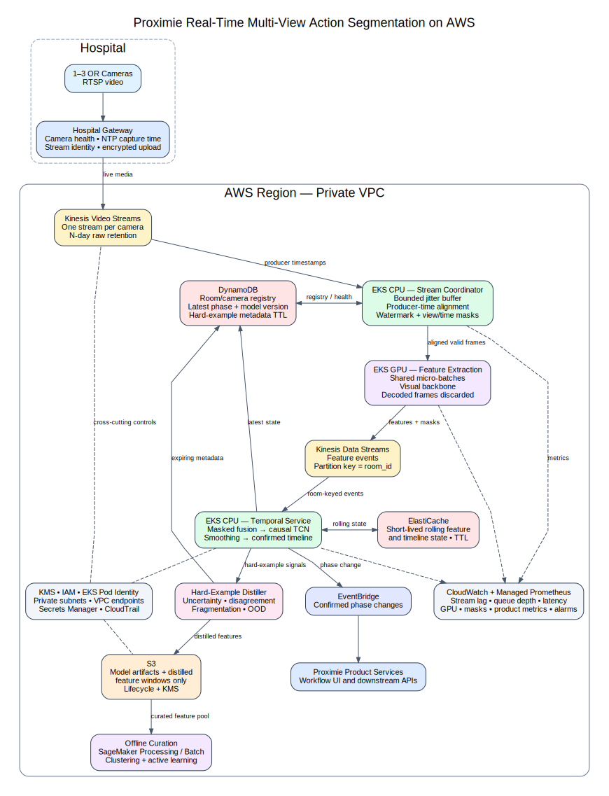

# AWS Real-Time Architecture

## 1. Architecture goal

Design a production path for one to three operating-room cameras that:

- ingests live streams in AWS;
- aligns asynchronous camera views;
- extracts visual features and predicts workflow phases online;
- preserves per-room temporal state;
- handles occlusion, missing views, and network jitter;
- respects the N-day raw-video retention rule;
- captures hard examples without creating a permanent raw-video archive;
- scales across hundreds of operating rooms without assigning one GPU to every room.

The primary design uses **Amazon EKS** for the streaming and inference plane. The reason is operational rather than model-related: multi-stream synchronization, GPU micro-batching, rolling temporal state, and custom backpressure are easier to manage as long-running services than as isolated request/response inference calls.

## 2. Primary architecture



### Main AWS services

| Service | Responsibility |
|---|---|
| Amazon Kinesis Video Streams | One live video stream per camera; producer timestamps; raw retention limited to the approved N-day policy. |
| Amazon EKS CPU services | Stream consumption, timestamp alignment, jitter buffering, missing-view masks, temporal inference, and timeline state. |
| Amazon EKS GPU services | Visual-backbone feature extraction with micro-batching across operating rooms. |
| Amazon Kinesis Data Streams | Ordered feature events, partitioned by `room_id`, between feature extraction and temporal inference. |
| Amazon ElastiCache for Valkey/Redis OSS | Short-lived rolling feature windows and recoverable per-room inference state. |
| Amazon DynamoDB | Room/camera registry, current phase, model version, latest timeline state, and expiring hard-example metadata. |
| Amazon EventBridge | Phase-change events and downstream integration. |
| Amazon S3 | Model artifacts and approved distilled feature windows; no permanent copy of new raw video. |
| Amazon CloudWatch | Logs, alarms, stream lag, latency, availability, and application metrics. |
| Amazon Managed Service for Prometheus | Kubernetes, GPU, queue, and service-level metrics. |
| AWS KMS, IAM, EKS Pod Identity, VPC endpoints | Encryption, least-privilege workload identity, and private service access. |

## 3. End-to-end live data flow

### Step 1 — Hospital gateway

The hospital gateway receives RTSP feeds from one to three cameras. It does not run the workflow model. Its responsibilities are limited to:

- camera authentication and health checks;
- NTP-synchronized capture timestamps;
- stable camera and operating-room identifiers;
- sequence numbers and reconnect handling;
- encrypted upload using the Kinesis Video Streams producer SDK or GStreamer plugin.

A separate Kinesis video stream is created for each camera. Stream metadata maps every camera to its operating room.

### Step 2 — Kinesis Video Streams ingestion

Kinesis Video Streams is the cloud entry point for live video. The system uses the **producer timestamp** as the synchronization clock and retains the ingestion timestamp for diagnostics.

Raw-video retention is configured to the hospital's approved threshold `N`. The live pipeline does not copy full streams into a permanent S3 raw-video lake.

Recommended stream identity:

```text
hospital_id / operating_room_id / camera_id
```

Example:

```text
hospital-014/or-07/camera-02
```

### Step 3 — Room registry and routing

A DynamoDB room registry stores:

```text
room_id
expected_camera_ids
Kinesis Video Streams ARNs
sampling policy
model version
retention policy
room status
```

The stream coordinator watches this registry and dynamically starts or stops processing when rooms become active.

### Step 4 — Bounded synchronization and jitter handling

A long-running EKS CPU service consumes the camera streams and maintains a small buffer for each operating room.

Initial synchronization policy:

```text
Common inference grid:       1 feature timestamp per second
Jitter buffer:               2 seconds, configurable
Frame matching tolerance:   nearest frame within ±250 ms
Timestamp source:            gateway/producer timestamp
Late-frame policy:           discard after watermark
Missing-frame policy:        set view_mask=False
```

For every second, the synchronizer emits one aligned room sample:

```text
room_id
slot_timestamp
camera_frames[1..3]
view_mask[1..3]
capture_skew_ms[1..3]
stream_health[1..3]
```

The slot is released when either:

1. all expected views arrive; or
2. the event-time watermark passes `slot_timestamp + jitter_buffer`.

This prevents one delayed camera from blocking the entire room indefinitely.

### Step 5 — GPU feature extraction

Aligned valid frames are sent to EKS GPU feature-extraction workers.

The workers:

- combine frames from several operating rooms into micro-batches;
- run the visual backbone only on valid views;
- output one task-specific feature vector per valid camera and timestamp;
- preserve `view_mask`, timestamps, and model version;
- discard decoded frames after extraction.

Output contract:

```text
room_id: string
slot_timestamp: float
features: [max_views, feature_dim]
view_mask: [max_views]
capture_skew_ms: [max_views]
feature_model_version: string
```

The current prototype uses `feature_dim=64`; a production backbone can use a larger dimension without changing the temporal contract.

### Step 6 — Ordered feature-event stream

Feature events are written to Kinesis Data Streams with:

```text
partition_key = room_id
```

Using the same room key keeps a room's events on the same shard. The producer also supplies monotonically increasing room sequence information so the temporal consumer can detect duplicates, gaps, or out-of-order records.

Kinesis Data Streams decouples GPU extraction from temporal inference and provides explicit stream-lag and backpressure signals.

### Step 7 — Stateful temporal inference

An EKS temporal-inference service consumes feature events and routes them by `room_id`.

For each room it maintains:

- the recent fused-feature window;
- current camera availability;
- TCN receptive-field context;
- current confirmed phase;
- pending phase and confirmation count;
- previous timeline boundary;
- last processed sequence number;
- model and configuration versions.

The service runs:

```text
masked multi-view fusion
→ causal TCN
→ probability smoothing
→ phase confirmation
→ contiguous timeline output
```

The TCN is lightweight enough to run on CPU after GPU feature extraction. This avoids reserving GPU capacity for the inexpensive temporal layer.

### Step 8 — State storage

The active rolling state remains in memory for lowest latency and is mirrored to ElastiCache with a short TTL.

Example state key:

```text
room-state:{room_id}:{model_version}
```

ElastiCache allows a replacement pod to recover the recent feature window and post-processing state after a restart.

DynamoDB stores lower-frequency durable product state:

```text
current phase
phase start time
confidence
availability status
camera count
model version
last update time
```

The distinction is:

- **ElastiCache:** fast, short-lived computation state;
- **DynamoDB:** durable current result and room metadata.

### Step 9 — Product output

Every confirmed phase change generates an EventBridge event:

```json
{
  "room_id": "or-07",
  "phase": "operation",
  "phase_start": "...",
  "confidence": 0.94,
  "available_views": 2,
  "model_version": "tcn-v3"
}
```

Downstream Proximie services can consume the event, while the latest state remains queryable from DynamoDB.

If all cameras are unavailable, the output is explicitly:

```text
unavailable
```

The system does not convert missing evidence into `empty` or another clinical phase.

## 4. Hard-example capture without permanent raw video

The inference service calculates hard-example signals online:

- high prediction entropy;
- low confidence;
- frequent phase switching;
- disagreement between camera views;
- disagreement between raw and cleaned predictions;
- unstable phase boundaries;
- out-of-distribution feature distance;
- low available-view count;
- high capture skew or stream lag.

When a threshold is reached, the pipeline writes a **distilled hard-example package**, not a raw video copy.

```text
pseudonymous room ID
time range
feature vectors before and after the event
view masks
capture-skew values
class probabilities
raw and cleaned predictions
hard-example reason
model/configuration versions
expiring source-stream reference, when policy permits
```

Storage policy:

- feature windows in an encrypted S3 prefix;
- metadata in DynamoDB with an expiration timestamp;
- S3 Lifecycle expiration aligned to the approved retention policy;
- no unrestricted raw-video export;
- access restricted to the clinical-ML review role;
- audit events recorded through CloudTrail.

Important privacy assumption: embeddings are **data-minimized representations**, not automatically anonymous. They remain protected as sensitive data because identity or scene information may still be encoded.

When permitted, the hard-example record may contain a temporary pointer to the original Kinesis Video Streams time range. The pointer becomes unusable when the original stream reaches its retention limit.

## 5. Cost-control strategy

### 5.1 Adaptive sampling

Use different feature rates according to room state:

```text
Empty/stable room:             low-rate sampling
Patient Present stable:        1 Hz baseline
Possible transition:           temporary higher rate
Operation:                     higher or full configured rate
All cameras unavailable:       no visual inference
```

The rate must be increased near transitions because aggressive sampling can damage start/end boundary accuracy.

### 5.2 Lightweight-first cascade

A cheap occupancy or scene-change stage can gate the expensive visual backbone when the room is clearly empty. It must include periodic forced checks to prevent a stale `empty` state.

### 5.3 Shared GPU micro-batching

Do not allocate one GPU per operating room. Batch valid camera frames from multiple rooms during a short batching window.

The batching window should be bounded by the latency objective, for example 50–100 ms, rather than waiting for a large batch.

### 5.4 Separate GPU and CPU work

Run the visual backbone on GPUs. Run synchronization, masked fusion, the small TCN, post-processing, and most metric calculations on CPU.

### 5.5 Autoscaling signals

Scale GPU feature workers primarily on:

- feature-extraction queue depth;
- oldest-event age;
- p95 inference latency;
- active stream count;
- GPU memory pressure.

GPU utilization alone is not a sufficient scaling signal because a GPU can remain highly utilized across different queue and latency conditions.

### 5.6 Capacity strategy

- keep a minimum On-Demand or reserved baseline for live clinical workloads;
- use Karpenter to add right-sized GPU nodes when demand rises;
- use Spot capacity only for interruptible offline curation, experimentation, or backfills;
- allow scale-to-zero only for non-live environments or inactive optional services.

### 5.7 Avoid duplicated raw storage

Kinesis Video Streams is the controlled raw-video retention layer. Do not also write every incoming stream to S3.

## 6. Failure handling

| Failure | Required behavior |
|---|---|
| One camera blocked | Continue with masked fusion over remaining views. |
| Camera disconnects | Mark the view unavailable and alert if duration exceeds threshold. |
| All cameras unavailable | Emit `unavailable`; do not invent a phase. |
| Frame arrives after watermark | Drop it and increment late-frame metrics. |
| Temporary GPU backlog | Reduce adaptive sampling before violating latency SLOs. |
| Feature event duplicated | Ignore using room sequence number/idempotency key. |
| Temporal pod restarts | Restore rolling state from ElastiCache and continue from the last sequence number. |
| State cannot be restored | Begin a new warm-up window and report degraded confidence. |
| Model deployment fails | Retain previous healthy deployment; use canary rollback. |
| Kinesis consumer lag rises | Autoscale consumers and alert on oldest-event age. |

## 7. Monitoring and operational metrics

### Stream health

- active camera streams;
- reconnect count;
- producer-to-cloud latency;
- late-frame rate;
- capture skew between views;
- fully missing timestamps.

### Feature and inference health

- feature queue depth;
- oldest feature-event age;
- GPU batch size and processing latency;
- temporal inference p50/p95 latency;
- available-view distribution;
- percentage of `unavailable` output;
- model confidence and entropy;
- raw-to-cleaned phase disagreement.

### Product quality

- Patient Present fragments per hour;
- Patient Present false-positive duration;
- Operation start/end delay;
- Operation coverage during occlusion;
- phase switches per hour;
- boundary stability;
- cost per active room-hour.

### Alerts

- stream or room silence;
- all views missing beyond threshold;
- oldest event exceeds latency SLO;
- GPU worker error rate;
- elevated phase fragmentation;
- hard-example rate changes sharply after a model deployment.

## 8. Security and governance

- Deploy EKS nodes and data services in private subnets.
- Use VPC endpoints where supported to avoid unnecessary public network paths.
- Encrypt Kinesis streams, S3 objects, DynamoDB tables, and ElastiCache at rest with KMS-managed keys.
- Use TLS in transit.
- Assign each EKS service account a narrow IAM role through EKS Pod Identity.
- Separate live-inference, offline-curation, and human-review permissions.
- Store secrets in AWS Secrets Manager rather than container images or environment files.
- Record administrative and data-access actions with CloudTrail.
- Tag every feature package with retention deadline, model version, and purpose.
- Verify deletion through inventory/audit jobs rather than assuming that lifecycle configuration alone is sufficient evidence.

## 9. Why EKS is the primary design

SageMaker real-time endpoints are a strong alternative for a stateless feature extractor or a simple model API. They provide managed hosting, monitoring, and autoscaling.

The primary design uses EKS because this workload needs more than a model endpoint:

- long-running Kinesis Video Streams consumers;
- per-room jitter buffers;
- custom event-time watermarks;
- GPU micro-batching across rooms;
- ordered streaming state;
- state restoration and idempotency;
- separate CPU and GPU worker pools;
- custom latency and backpressure handling.

A hybrid deployment remains possible:

```text
EKS synchronization and stateful timeline services
+ SageMaker endpoint for stateless feature extraction
```

The first production version should choose one operational model and avoid splitting responsibilities across EKS and SageMaker without a measured benefit.

## 10. Prototype-to-production mapping

| Current repository component | Production equivalent |
|---|---|
| Synthetic multi-view generator | Kinesis Video Streams plus synchronizer |
| `view_mask` and `time_mask` | Missing-view and watermark output |
| Masked mean fusion | Online multi-view feature fusion |
| Causal TCN | Per-room temporal inference service |
| Causal smoothing/debouncing | Stateful timeline generator |
| `unavailable` label | All-view-loss fallback state |
| Error-analysis masks | Stream health, occlusion, and hard-example metadata |
| JSON metrics | CloudWatch/Prometheus product-quality metrics |
| Local checkpoint | Versioned model artifact in S3/ECR deployment |

## 11. Explicit design assumptions

- One operating room has one to three cameras.
- Cameras are registered before use and are synchronized approximately through the hospital gateway.
- A two-second jitter buffer is an initial engineering value, not a validated clinical requirement.
- The prototype rate of 1 Hz is the baseline temporal rate; production may increase sampling around transitions.
- Masked mean is the first fusion baseline; confidence-weighted or attention fusion can replace it behind the same interface.
- Raw video remains governed by the N-day source retention rule.
- Distilled embeddings remain sensitive data.
- Live inference favors availability and bounded latency over perfect retrospective boundary accuracy.

## 12. Official AWS references

- Amazon Kinesis Video Streams overview: https://docs.aws.amazon.com/kinesisvideostreams/latest/dg/what-is-kinesis-video.html
- Kinesis Video Streams retention configuration: https://docs.aws.amazon.com/kinesisvideostreams/latest/APIReference/API_CreateStream.html
- Kinesis Data Streams concepts: https://docs.aws.amazon.com/streams/latest/dev/key-concepts.html
- Kinesis Data Streams `PutRecord`: https://docs.aws.amazon.com/kinesis/latest/APIReference/API_PutRecord.html
- Amazon EKS inference workloads: https://docs.aws.amazon.com/eks/latest/userguide/ml-inference.html
- Amazon EKS GPU autoscaling: https://docs.aws.amazon.com/eks/latest/userguide/ml-inference-autoscaling.html
- SageMaker real-time endpoints: https://docs.aws.amazon.com/sagemaker/latest/dg/realtime-endpoints.html
- S3 Lifecycle management: https://docs.aws.amazon.com/AmazonS3/latest/userguide/object-lifecycle-mgmt.html
- DynamoDB TTL: https://docs.aws.amazon.com/amazondynamodb/latest/developerguide/TTL.html
- EKS Pod Identity: https://docs.aws.amazon.com/eks/latest/userguide/pod-identities.html
- CloudWatch Container Insights for EKS: https://docs.aws.amazon.com/AmazonCloudWatch/latest/monitoring/Container-Insights-metrics-enhanced-EKS.html
- Amazon Managed Service for Prometheus: https://docs.aws.amazon.com/prometheus/latest/userguide/what-is-Amazon-Managed-Service-Prometheus.html
